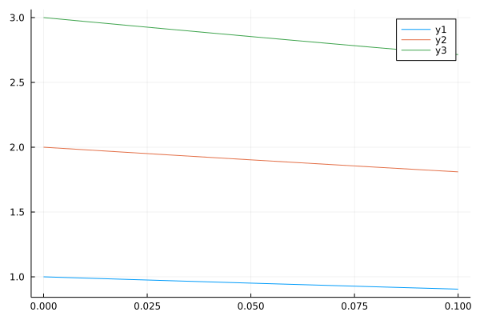

# SimulationLogger
SimulationLogger.jl is a package providing convenient logging tools for [DifferentialEquations.jl](https://github.com/SciML/DifferentialEquations.jl).

## Packages related to SimulationLogger.jl
- [FlightSims.jl](https://github.com/JinraeKim/FlightSims.jl) is a general-purpose numerical simulator,
and it uses SimulationLogger.jl as a main logging tool. You can find real examples about **how to use this package** in FlightSims.jl.

# TL; DR: example code
## Example 1: typical usage
See [FlightSims.jl](https://github.com/JinraeKim/FlightSims.jl) for details.

## Example 2: low-level usage
```julia
using SimulationLogger
using DifferentialEquations
using Transducers
using Plots
using Test


function test()
    @Loggable function dynamics!(dx, x, p, t; u)
        @onlylog state, input = x, u  # __LOGGER_DICT__[:state] = x, __LOGGER_DICT__[:input] = u
        dx .= u
    end
    @Loggable function custom_control(x)
        @log a = 1
        -a*x
    end
    @Loggable function feedback_dynamics!(dx, x, p, t)
        @onlylog time = t  # __LOGGER_DICT__[:time] = t
        @log x, t  # __LOGGER_DICT__[:x] = x
        u = @nested_log custom_control(x)  # __LOGGER_DICT__[:a] = 1
        @log u  # __LOGGER_DICT__[:u] = -a*x
        @nested_log :linear x
        @nested_log :linear dynamics!(dx, x, p, t; u=u)
    end
    t0, tf = 0.0, 0.1
    Δt = 0.01
    saved_values = SavedValues(Float64, Dict)
    cb = CallbackSet()
    if hasmethod(feedback_dynamics!, Tuple{Any, Any, Any, Any, __LOG_INDICATOR__})
        # to avoid undefined error when not adding @Loggable
        log_func(x, t, integrator::DiffEqBase.DEIntegrator; kwargs...) = feedback_dynamics!(zero.(x), copy(x), integrator.p, t, __LOG_INDICATOR__(); kwargs...)
        cb = SavingCallback(log_func, saved_values; saveat=t0:Δt:tf)
    end
    # # sim
    x0 = [1, 2, 3]
    tspan = (t0, tf)
    prob = ODEProblem(
                      feedback_dynamics!, x0, tspan;
                      callback=cb,
                     )
    _ = solve(prob)
    ts = saved_values.saveval |> Map(datum -> datum[:t]) |> collect
    xs = saved_values.saveval |> Map(datum -> datum[:x]) |> collect
    us = saved_values.saveval |> Map(datum -> datum[:u]) |> collect
    times = saved_values.saveval |> Map(datum -> datum[:time]) |> collect
    states = saved_values.saveval |> Map(datum -> datum[:linear][:state]) |> collect
    inputs = saved_values.saveval |> Map(datum -> datum[:linear][:input]) |> collect
    as = saved_values.saveval |> Map(datum -> datum[:a]) |> collect
    @test ts == saved_values.t
    @test ts == times
    @test xs == states
    @test us == inputs
    @test as == ones(length(ts))
    p_x = plot(ts, hcat(xs...)')
    p_u = plot(ts, hcat(us...)')
    dir_log = "figures"
    mkpath(dir_log)
    savefig(p_x, joinpath(dir_log, "state.png"))
    savefig(p_u, joinpath(dir_log, "input.png"))
end
```



# Main macros
## `@Loggable`
`@Loggable` is a macro that makes an ODE function *loggable*.
### Example
```julia
@Loggable function dynamics!(dx, x, p, t)
    dx .= -x
end
```
### Mechanism
`@Loggable` generates additional method for the generic function of the annotated function definition.
The additional method receives `__log__indicator__::__LOG_INDICATOR__` as the last argument (other arguments are the same as the original function definition).
### Notice
- This macro is supposed to be used in front of "function definition". For example,
```julia
@Loggable function dynamics!(dx, x, p, t)
    dx .= -x
end
```
is good.
```julia
@Loggable dynamics! = (dx, x, p, t) -> dx .= -x
```
may not work properly.
## `@log`
This macro logs the annotated variable, and also executes the followed expression when *both solving DEProblem and logging data*.
### Example
```julia
@Loggable function dynamics!(dx, x, p, t)
    @log state = x
    @log p  # the same as `@log p = p`
    dx .= -x
end
```

## `@onlylog`
This macro logs the annotated variable, and also executes the followed expression *only when logging data*.
### Example
```julia
@Loggable function dynamics!(dx, x, p, t)
    @log u = x
    @onlylog input = u   # `input` is not visible in this function when solving DEProblem.
    dx .= -u
end
```

## `@nested_log`
This macro logs (possibly) multiple data in a nested sense.
### Example
1. nested log with specified name
```julia
@Loggable function dynamics!(dx, x, p, t)
    @log state = x  # __LOGGER_DICT__[:state] = x
    dx .= -x
end

@Loggable function feedback_dynamics!(dx, x, p, t)
    @log time = t  # __LOGGER_DICT__[:time] = t
    @nested_log :linear dynamics!(dx, x, p, t)  # __LOGGER_DICT__[:linear] = Dict(:state => x)
end
```
2. nested log with no name
```julia
@Loggable function dynamics!(dx, x, p, t)
    @log state = x  # __LOGGER_DICT__[:state] = x
    dx .= -x
end

@Loggable function feedback_dynamics!(dx, x, p, t)
    @log time = t  # __LOGGER_DICT__[:time] = t
    @nested_log dynamics!(dx, x, p, t)  # __LOGGER_DICT__[:state] = x
end
```
3. `@nested_log` with assignment
```julia
@Loggable function dynamics!(dx, x, p, t; u)
    @log state = x  # __LOGGER_DICT__[:state] = x
    @log input = u  # __LOGGER_DICT__[:input] = u
    dx .= u
end

@Loggable function control(x)
    @log a = 1  # hidden state; internally defined variable
    -a*x
end

@Loggable function feedback_dynamics!(dx, x, p, t)
    @log time = t  # __LOGGER_DICT__[:time] = t
    u = @nested_log control(x)  # __LOGGER_DICT__[:a] = 1
    @nested_log dynamics!(dx, x, p, t; u)  # __LOGGER_DICT__[:state] = x
end
```

## `@nested_onlylog`
This macro logs (possibly) multiple data in a nested sense **only when logging data** (similar to `@onlylog`).


# NOTICE
- `__LOGGER_DICT__` is a privileged name to contain variables annotated by logging macros. **DO NOT USE THIS NAME IN USUAL CASE**.
- This package supports only [**in-place** method](https://diffeq.sciml.ai/stable/basics/problem/#In-place-vs-Out-of-Place-Function-Definition-Forms) of DifferentialEquations.jl.


# Notes
## Background of this package
- This basic form of this macro is inspired by [SimulationLogs.jl](https://github.com/jonniedie/SimulationLogs.jl). But there are some differences. For example, `@log` in this package is based on [SavingCallback](https://diffeq.sciml.ai/stable/features/callback_library/#saving_callback), while `@log` in [SimulationLogs.jl](https://github.com/jonniedie/SimulationLogs.jl) will save data in the sense of postprocessing.
There are two main advantages: this package can 1) log data without repeating the same code within differential equation (DE) functions, and 2) deal with stochastic parameter updates.
For more details, see [the original question](https://discourse.julialang.org/t/differentialequations-jl-saving-data-without-redundant-calculation-of-control-inputs/62559/3) and [the idea of this package](https://discourse.julialang.org/t/make-a-variable-as-a-global-variable-within-a-function/63067/21).

## Feature request and bug report
Please feel free to request additional features and report bugs!
